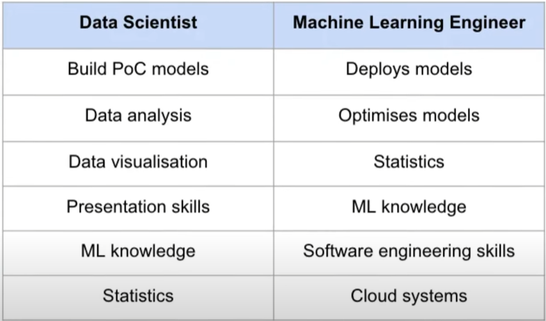
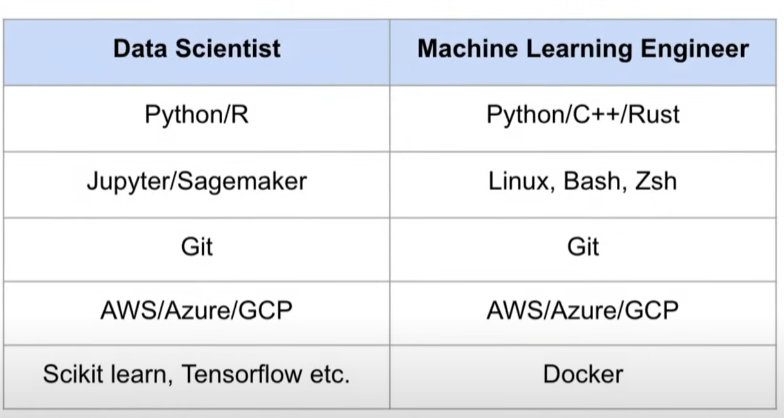

# AWS, Azure， GCP

# Docker kubernetes

# data scientist

# MLE

# 特征值，特征向量 Eigenvalues, eigenvectors

特征降维方法如SVD和PCA

PCA的目的，其实就是为了找到一组样本数据中能代表最最主要方向（变量/维度）的这些基向量（特征向量），并保留前几个主要（特征值）的特征向量（主成分）。

PCA过程的本质，其实就是变量（维度）协方差矩阵对角化。 体现了方差和协方差、特征值与特征向量的内涵应用。

特征值和特征向量的应用实例——主成分分析（Principle Component Analysis, PCA）

主成分分析是利用降维的思想，通过线性变换，把数据变换到一个新的坐标系统中，使得任何数据投影的第一大方差在第一个坐标(称为第一主成分)上，第二大方差在第二个坐标(第二主成分)上，依次类推。最终将一组样本数据的多个变量（维或特征）转化为保留下来的少数几个综合变量（即主成分，其中每个主成分都是原始变量的线性组合，各主成分之间互不相关），从而这些主成分能够反映始变量的绝大部分信息，且所含的信息互不重叠。

或者这样描述，将一组 N 维向量降为 K 维，其目标是选择 K 个单位正交基，使得原始数据变换到这组基上后，各变量两两间协方差为 0，而变量自身方差则尽可能大(在正交的约束下，取最大的 K 个方差)。

 

假设用p个变量（维度）来描述研究对象，分别用X1，X2…Xp来表示，这p个变量构成的p维随机向量为X=(X1，X2…Xp)，n个样本构成组成了n行p列的矩阵A。主成分求解过程如下：

　　第一步，求解得到矩阵A的协方差阵B；

　　第二步，求解协方差阵B，得到按大小顺序排列的特征值向量，为特征值向量中每个特征值组成的对角矩阵，U为所有特征值对应的特征向量构成的矩阵，因此有。重点来了，U是由特征向量构成的正定阵（即每个特征向量也由原始n维度构成），向量的每一行可以视为一个的基向量，这些基向量经过矩阵B转换后，得到了在各个基向量上的伸缩，伸缩的大小即为特征值。

　　第三步，主成分个数选择，根据特征值的大小，将特征值较大的作为主成分（一般取前累计85%+），其对应的特征向量就为基向量，特征值的筛选根据实际情况而定，一般大于1即可考虑作为主成分。

# SVD

https://bainingchao.github.io/2018/10/11/%E4%B8%80%E6%AD%A5%E6%AD%A5%E6%95%99%E4%BD%A0%E8%BD%BB%E6%9D%BE%E5%AD%A6%E5%A5%87%E5%BC%82%E5%80%BC%E5%88%86%E8%A7%A3SVD%E9%99%8D%E7%BB%B4%E7%AE%97%E6%B3%95/