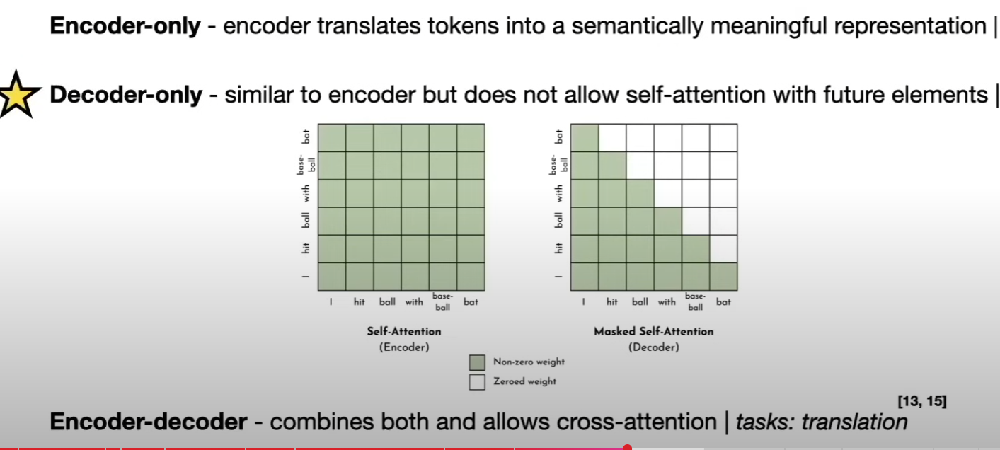

# Retrieval Augmented Generation (RAG)

# Fine-tuned model

# zero-shot, one-shot, Few-shot
样本学习
句子：。。。。
情感 good or not

one-shot 给一个样本

# Next.js, Remix

# Machine learning 

# Data pipeline

# ETL

# Typescript, Python, Rust and React, Express, PostgreSQL 

# Power BI

# Create dashboards in Databricks, Power BI, and Bazefield.

# Model Architecture

encoder only: translate token to a semanticaly meaningful representation: tasks: text classification

Decoder only: similar to encoder but does not allow self-attention with future elements: tasks: text generation

encoder-decoder : combines both and allows cross-attention tasks: translation

# 20 tokens per model parameter